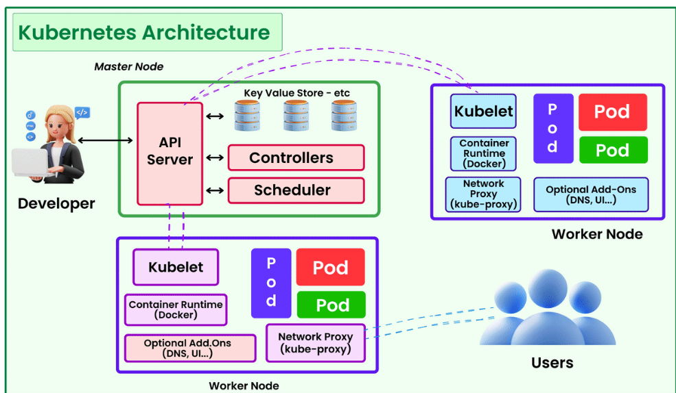

## Kubernete
1. its Container Orchestration Engine(CoE).
2. Kuberentes Cluster: Combination of Multiple nodes(Master and worker node)
3. Kuberentes components 
   1. Master Node Components(Control Plane):
       1. Kube API Server: its fron-end of the kubernetes control plane
       2. ETCD: its store the cluster data, storing in the form of key: value pair
       3. Kube-Schedular: kube-schedular responisible for assiging nodes on newly cretaed pods based on resource(CPU and RAM), policy constrains and node affinity.
       4. Control Manager: its maiantaining the current state = desire state 
           eg: replicas: 5 in cluster 4 pods 
   2. Worker Node Components
       1. Kubelet: its Agent run on every node in the cluster, its ensure containers running in the Pod and send reports to control plane
       2. Kube-Proxy
       3. Container Run Time(continerD) 
       4. 